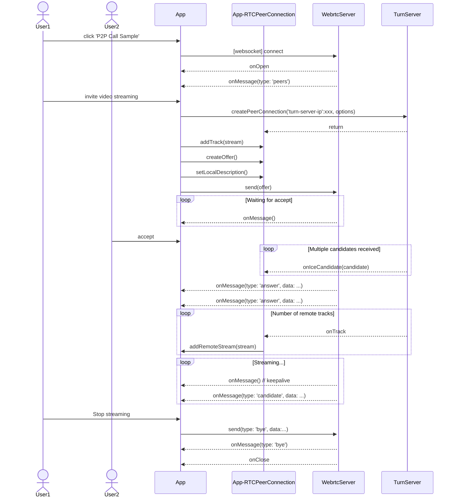

```mermaid
sequenceDiagram
    actor User1
    actor User2
    participant App
    participant conn as App-RTCPeerConnection
    participant WebrtcServer
    participant TurnServer

    User1->>App: click 'P2P Call Sample'
    App->>+WebrtcServer: [websocket] connect
    WebrtcServer-->>App: onOpen
    WebrtcServer-->>App: onMessage(type: 'peers')

    User1->>App: invite video streaming
    App->>TurnServer: createPeerConnection('turn-server-ip':xxx, options);
    TurnServer-->>conn: return
    App->>conn: addTrack(stream);
    App->>conn: createOffer()
    App->>conn: setLocalDescription()
    App->>WebrtcServer: send(offer)

    loop Waiting for accept
        WebrtcServer-->>App: onMessage()
    end
    User2->>App: accept

    loop Multiple candidates received
        TurnServer-->>conn: onIceCandidate(candidate)
    end

    WebrtcServer-->>App: onMessage(type: 'answer', data: ...)
    WebrtcServer-->>App: onMessage(type: 'answer', data: ...)

    loop Number of remote tracks
        TurnServer-->>conn: onTrack
        conn->>App: addRemoteStream(stream);
    end

    loop Streaming...
        WebrtcServer-->>App: onMessage() // keepalive


        WebrtcServer-->>App: onMessage(type: 'candidate', data: ...)
    end

    User1->>App: Stop streaming
    App->>WebrtcServer: send(type: 'bye', data:...)
    WebrtcServer-->>App: onMessage(type: 'bye')

    WebrtcServer-->>App: onClose

```